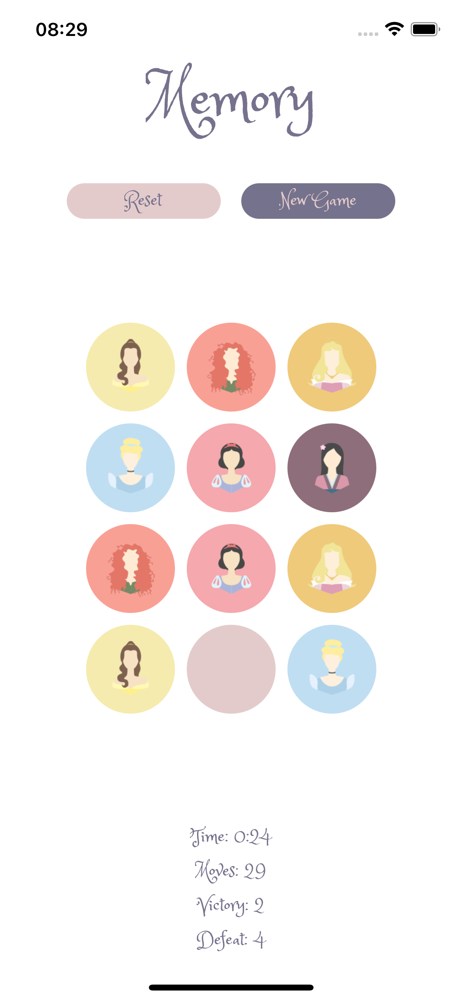

<br/>
<p align="center">
  <a href="https://github.com/nurycaroline/memoria-disney">
    
  </a>

  <h3 align="center">Memória</h3>

  <p align="center">
    Jogo da memoria com o tema de princesas da Disney
    <br/>
    <br/>
    <a href="https://www.figma.com/community/file/1212020337394409085">Layout</a>
    .
    <a href="https://github.com/nurycaroline/memoria-disney/issues">Report Bug</a>
  </p>
</p>

## Sobre o projeto
<div>
  
  
  
<div>


Para exercitar alguns conhecimentos e testar algumas bibliotecas, criei um jogo da memória com o tema de princesas da Disney.

E esse projeto, faz parte de um projeto maior, onde recrio jogos clássicos utilizando temas de filmes e séries.
Outros projetos:

* [Quem é esse Pokémon?](https://github.com/nurycaroline/quem-e-esse-pokemon)
* [Warships](https://github.com/nurycaroline/warship)

## Aprendizados nesse projeto

* Utilização do Expo
* Implementação de Internacionalização
* Implementação de animações com Lottie
* Utilização de Recoil para gerenciamento de estado

## Bibliotecas utilizadas

* [Typescript](https://www.typescriptlang.org/)
* [React Native](https://reactnative.dev/)
* [Expo](https://expo.io/)
* [Lottie](https://lottiefiles.com/)
* [Recoil](https://recoiljs.org/)
* [Styled Components](https://styled-components.com/)
* [internationalization](https://react.i18next.com/)
* [React Modalize](https://jeremybarbet.github.io/react-native-modalize/#/)
* [Expo Font](https://docs.expo.io/versions/latest/sdk/font/)
* [Expo Music](https://docs.expo.dev/versions/latest/sdk/audio/)

## Recursos

* Fonte: [Google Fonts - Princess Sofia](https://fonts.google.com/specimen/Princess+Sofia?query=princess)
* Imagens Princesas: [Pinterest - Princess Collection](https://br.pinterest.com/nickissaurus/silueta-de-princesa-disney/princess-collection/)
* Animações:
  * [Lotties - Troféu](https://lottiefiles.com/107653-trophy)
  * [Lotties - Castelo](https://lottiefiles.com/112589-castle)
* Musicas:
  * Music by Slip.stream - [All Kinds Of Magic](https://slip.stream/tracks/bb777c13-80fd-4c68-94b2-d658fe2497bd)

## Configuração local

Instruções sobre a configuração de seu projeto localmente.
Para obter uma cópia local em execução, siga esses simples exemplos de etapas.

### Pré-requisitos

Ter o app do expo instalado no celular
[Expo](https://play.google.com/store/apps/details?id=host.exp.exponent&hl=pt_BR&gl=US)

* Instalar o yarn

```sh
npm install --global yarn
```

### Instalação

1.Copie o repositório

```sh
git clone https://github.com/nurycaroline/memoria-disney.git
```

2.Instale as dependências

```sh
yarn install
```

3.Inicie o projeto

```sh
yarn expo start
```

## Roadmap

See the [open issues](https://github.com/users/nurycaroline/projects/6/views/1) for a list of proposed features (and known issues).

## License

Distributed under the MIT License. See [LICENSE](https://github.com/nurycaroline/memoria-disney/blob/main/LICENSE.md) for more information.

## Autora

* [Nurielly Caroline Brizola](https://github.com/nurycaroline)

## Agradecimentos

Pessoas que desenvolveram comigo este desafio:

* [Ingrid Almeida](https://github.com/ingridsj)
* [Luiza Marlene](https://github.com/luizamarlene)
